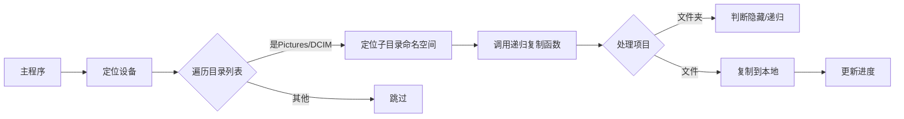

# 
说明

基于python语言

 
需要下载pythoncom库
 
本地保存目录在代码的第243行。
 
目前只有Pictures文件夹可以保存
 
DCIM只需修改143行的Pictures为DCIM即可

```mermaid
graph LR
A[主程序] --> B[定位设备] --> C{遍历目录列表}
C --是Pictures/DCIM--> D[定位子目录命名空间]
C --其他--> E[跳过]
D --> F[调用递归复制函数]
F --> G{处理项目}
G --文件夹--> H[判断隐藏/递归]
G --文件--> I[复制到本地]
I --> J[更新进度]
```
